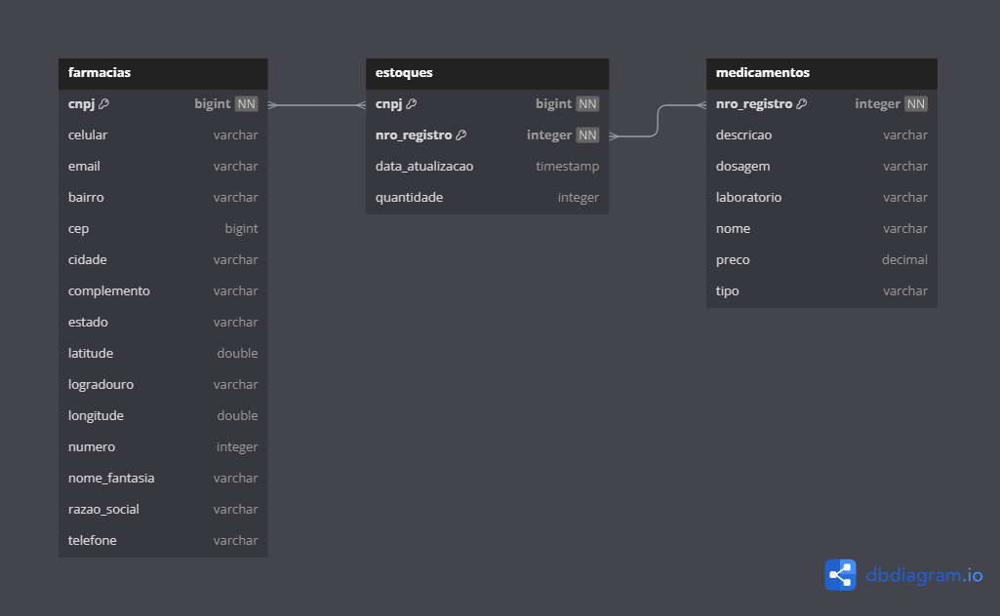
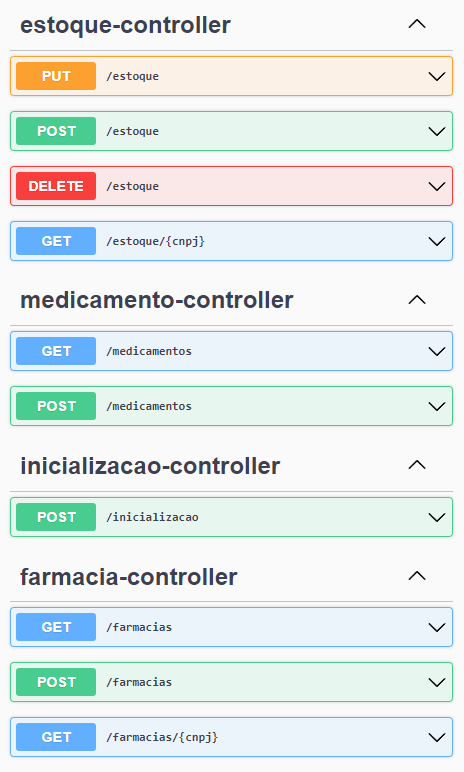

<h1 align="center">Pharma API</h1>

<p align="center">
  <a href="#-tecnologias">Tecnologias</a>&nbsp;&nbsp;&nbsp;|&nbsp;&nbsp;&nbsp;
  <a href="#-projeto">Projeto</a>&nbsp;&nbsp;&nbsp;|&nbsp;&nbsp;&nbsp;
  <a href="#-documentação-da-api">Documentação</a>&nbsp;&nbsp;&nbsp;|&nbsp;&nbsp;&nbsp;
  <a href="#memo-licença">Licença</a>
</p>

<br>

## 🚀 Tecnologias

Esse projeto foi desenvolvido com as seguintes tecnologias:

| Tecnologia                                                                                                           | Funcionalidade                                                                                                                              |
|----------------------------------------------------------------------------------------------------------------------|---------------------------------------------------------------------------------------------------------------------------------------------|
|             | linguagem utilizada de forma básica e avançada para estruturas de decisão e repetição, orientação a objetos e mapeamento objeto-relacional. |
|  | como fonte de dados, fazendo uso da linguagem SQL para persistência dos dados.                                                              |
|          | framework para construção de uma API REST completa e funcional.                                                                             | 
|                   | versionamento de código em repositório local.                                                                                               |
|          | versionamento de código em repositório remoto.                                                                                              | 


## 💻 Projeto

**Uma aplicação de API REST para gerenciamento do cadastro de medicamentos e farmácias**, proporcionando funcionalidades de controle de estoque. A plataforma permite o cadastramento de medicamentos, a consulta dos registros existentes e a obtenção de detalhes específicos de cada item.

Adicionalmente, a aplicação oferece a capacidade de cadastrar o estoque das farmácias, proporcionando opções para inclusão, deleção e transferência de medicamentos entre unidades.

## Banco de Dados

Diagrama de tabelas do projeto:

<p align="center">
  
</p>

## 🔖 Documentação da API

Para implementação das funcionalidades foram desenvolvidos os seguintes endpoints:

<p align="center">
  
</p>

## 🏥 Farmácias

### Inclusão de Farmácia
```http
  POST /farmacias
```

```http
{
  "cnpj": 90561736000121,
  "razaoSocial": "DevMed Ltda",
  "nomeFantasia": "Farmácia DevMed",
  "email": "devmed@farmacia.com",
  "telefone": "(44)4444-4444",
  "celular": "(44)9444-4441",
  "endereco": {
    "cep": 88888999,
    "logradouro": "Rua Porto Real",
    "numero": 67,
    "bairro": "Westeros",
    "cidade": "Berlim",
    "estado": "SC",
    "complemento": "Sala 02",
    "latitude": 15.23456,
    "longitude": 2.8678687
  }
}
  ```


| Parâmetro   | Tipo      | Descrição                           |
| :---------- |:----------| :---------------------------------- |
| `cnpj`      | `long`    | **Obrigatório** |
| `razaoSocial` | `string`  | **Obrigatório** |
| `nomeFantasia` | `string`  | **Obrigatório** |
| `email` | `string`  | **Obrigatório** |
| `telefone` | `string`  |Opcional|
| `celular` | `string`  | **Obrigatório**|
| `endereco` | `objeto`  | **Obrigatório**|
| `cep` | `long`    | **Obrigatório**|
| `logradouro` | `string`  | **Obrigatório**|
| `numero` | `integer` | **Obrigatório**|
| `cidade` | `string`  | **Obrigatório**|
| `estado` | `string`  | **Obrigatório**|
| `complemento` | `string`  | Opcional|
| `latitude` | `double`  | **Obrigatório**|
| `longitude` | `double`  | **Obrigatório**|

### Listagem de Farmácias
```http
  GET /farmacias
```
Retorna lista de farmácias através de JSON.

### Consulta de Farmácia
```http
  GET /farmacias/{cnpj}
```

Retorna consulta do CNPJ informado através de JSON.

## 💊 Medicamentos

### Inclusão de Medicamento

```http
  POST /medicamentos
```
```http
{
  "nroRegistro": 9876,
  "nome": "Medicine",
  "laboratorio": "Matrix",
  "dosagem": "2x ao dia",
  "descricao": "Descricao",
  "preco": 11.0,
  "tipo": "COMUM"
}
```
| Parâmetro   | Tipo      | Descrição                                           |
| :---------- |:----------|:----------------------------------------------------|
| `nroRegistro`      | `integer` | **Obrigatório**                                     |
| `nome` | `string`  | **Obrigatório**                                     |
| `laboratorio` | `string`  | **Obrigatório**                                     |
| `dosagem` | `string`  | **Obrigatório**                                     |
| `descricao` | `string`  | **Obrigatório**                                            |
| `preco` | `float`   | **Obrigatório**                                     |
| `tipo` | `string`  | **Obrigatório** ENUM valor 'COMUM' ou 'CONTROLADO'; | 

### Listagem de Medicamentos

```http
  GET /medicamentos
```
Retorna lista de medicamentos através de JSON.


## 📦 Estoque

### Inclusão de Estoque
```http
  POST /estoque
```

```http
{
  "cnpj": 90561736000121,
  "nroRegistro": 2233,
  "quantidade": 3
}
```
| Parâmetro     | Tipo      | Descrição                                           |
|:--------------|:----------|:----------------------------------------------------|
| `cnpj`        | `long`    | **Obrigatório**                                     |
| `nroRegistro`        | `integer` | **Obrigatório**                                     |
| `quantidade` | `integer` | **Obrigatório**                                     |

### Listagem de Estoque
```http
  GET /estoque/{cnpj}
```
Retorna lista de consulta de estoque através de JSON.

### Exclusão de Estoque
```http
  DELETE /estoque
```

```http
{
  "cnpj": 90561736000121,
  "nroRegistro": 2233,
  "quantidade": 3
}
```

### Transferência de Estoque

```http
  PUT /estoque
```

```http
{
  "registro": 1010,
  "cnpjOrigem": 90561736000121,
  "quantidadeOrigem": 10,
  "cnpjDestino": 43178995000198,
  "quantidadeDestino": 7
}
```
## 💾 Carga Inicial de Dados

```http
  POST /inicializacao
```
Realiza carga inicial de dados populando tabelas com dados fictícios para usabilidade e teste das funcinalidades.

## 🏃 Iniciando o Projeto
Primeiro clone este repositório remoto em sua máquina local:

[https://github.com/denisonkolling/pharma-api.git](https://github.com/denisonkolling/pharma-api.git)

Lembre-se de adicionar as dependências do projeto maven, o projeto inclui Open API Swagger UI.


Realize a configuração do seu banco de dados local em ```pharma-api/src/main/resources/application.properties```:

```bash
spring.datasource.url=${DB_URL}
spring.datasource.username=${DB_USERNAME}
spring.datasource.password=${DB_PASSWORD}
```
Inicie a aplicação em sua IDE de preferência.

Acesse [http://localhost:8080/swagger-ui/index.html](http://localhost:8080/swagger-ui/index.html) através de seu navegador para acessar a aplicação.

## 💹 Possíveis Melhorias

Como a aplicação está atualmente em estágio de protótipo funcional, podem ser aplicadas diversas melhorias ou criadas novas funcionalidades:
- Implementação de camadas de segurança para autenticação e autorização de usuários.
- Melhorias no tratamento de exceções.

## 📝 Licença

Este projeto está sob a licença MIT.

---